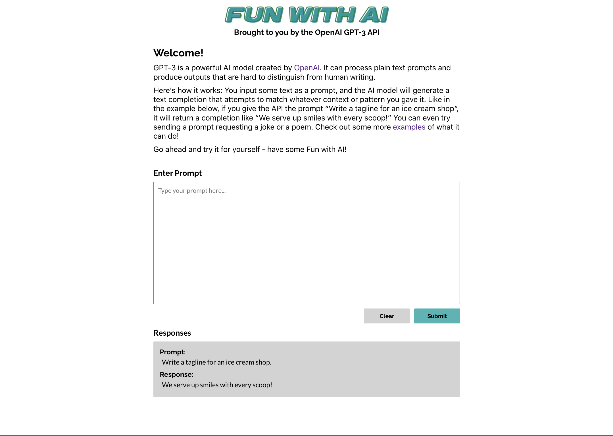
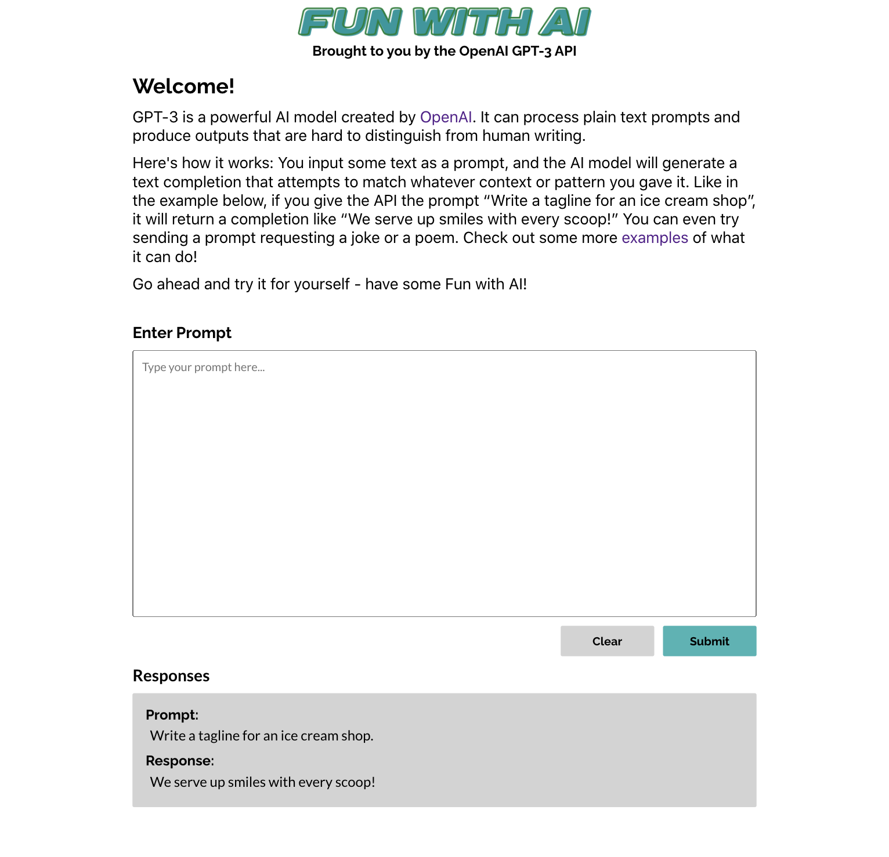
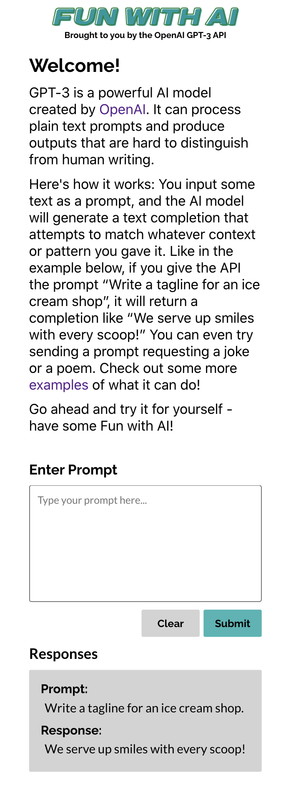

## Fun with AI

#### Fun with AI: Brought to you by the OpenAI GPT-3 API!

A responsive web application used to send plain text prompts to the OpenAI API and display the prompts and responses in a list. Built with React, JavaScript, and SCSS.

Visit the deployed app here: [ahayes-fun-with-ai.netlify.app](https://ahayes-fun-with-ai.netlify.app)

## Project Screen Shots

#### Desktop:

#### Tablet:

#### Mobile:

## Reflection

This project was built by me over 5 days as a technical challenge for the Shopify Frontend Developer Internship. Project goals included using technologies learned up until this point and familiarizing myself with ways to implement new features.

I met the technical requirements for this project as follows:

  - Results come from OpenAI’s completions API.
  - Each result includes the original prompt entered and the response from the API.
  - Responses are stored in order of newest to oldest.
  - The application is accessible and the HTML that is served client-side is semantic.

I chose to add the following extra features to improve the application:

  - Made the application fully responsive by adusting the design for mobile, tablet and laptop/desktop breakpoints.
  - Utilized Local Storage to save data so that the application stores prompts and responses if the user leaves or reloads the page.

I wanted to build a responsive web application using a mobile first approach that allowed users to send plain text prompts to the OpenAI API and display the prompts and responses in a list. I started this process by using the `create-react-app` boilerplate, then adding `openai-api` and `sass`.

At the end of the day, the technologies implemented in this project are React, OpenAI API, JavaScript, JSX, Flexbox and SCSS. I chose to use the `create-react-app` boilerplate to minimize initial setup and invest more time into styling this as a responsive app.

## Installation and Setup Instructions

Clone down this repository. You will need `node` and `npm` installed globally on your machine.  

Installation:

`npm install`  

To Start Server:

`npm start`  

To Visit App:

`http://localhost:3000/`
